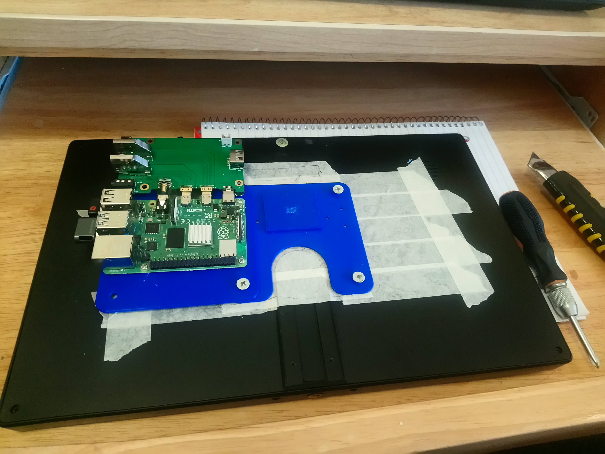
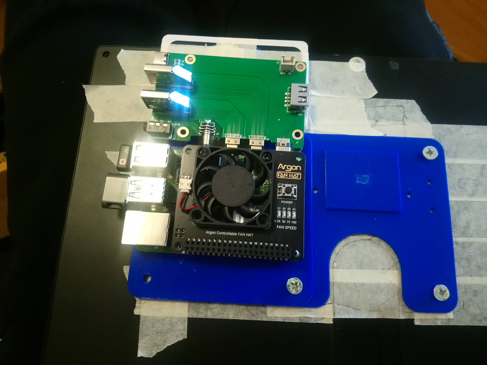
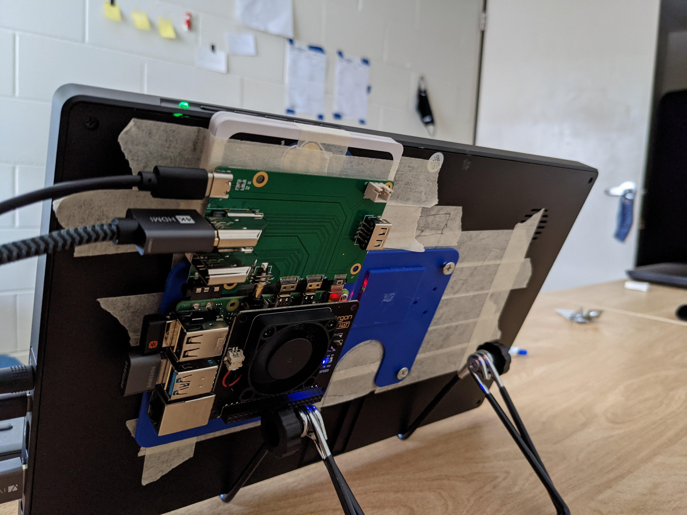
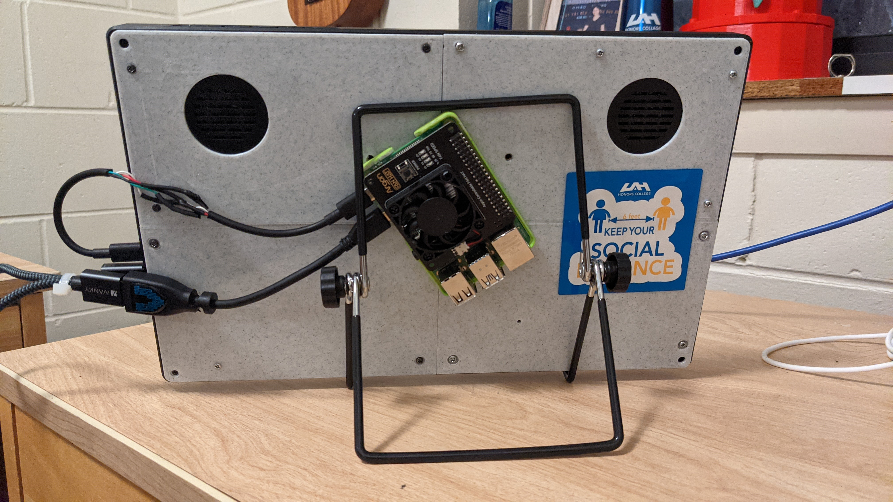
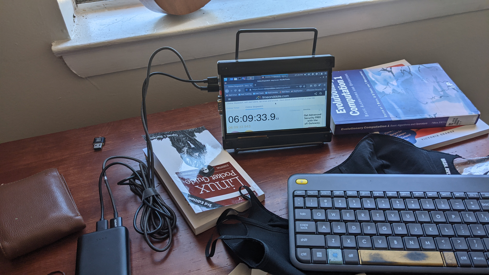
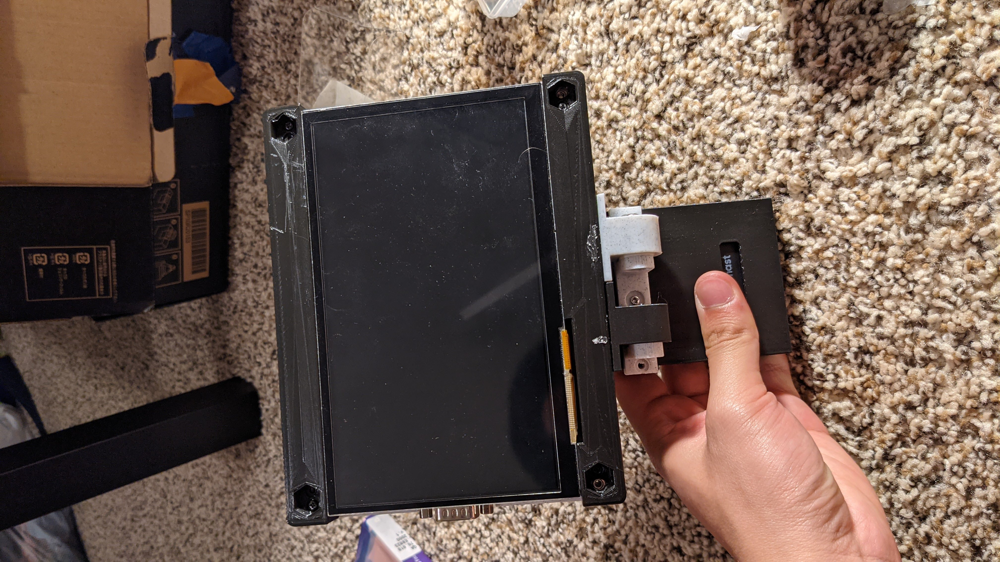
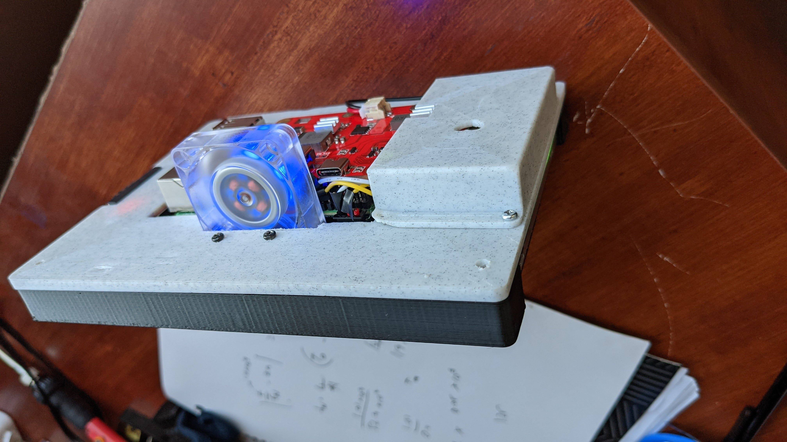
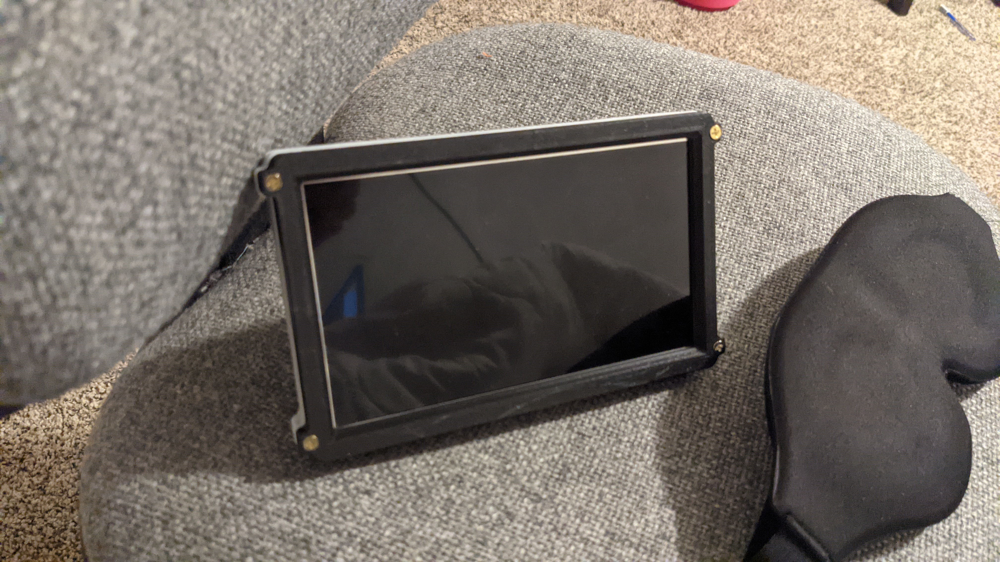
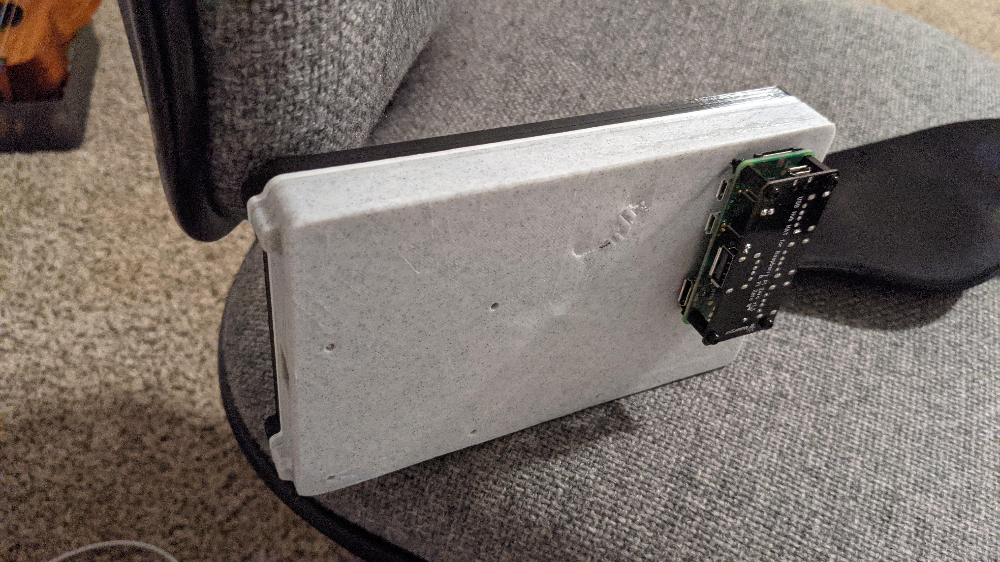
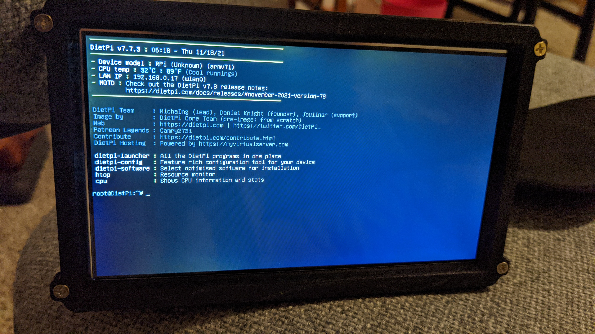

# pi-tablet
The CAD file (perfectly editable): https://cad.onshape.com/documents/283c1f31dc07407e5f848c64/w/50fb17fa12b0c5329912ae54/e/41b3ec8f5c27facef2add061?renderMode=0&uiState=6199a9a62338b64961d45a35
This is definitely the longest and most meaningful hardware design project I have ever done.

So roughly 6 months ago, as my interest in my newly acquired Raspberry Pi 4 grew, I decided to buy a 10'' portable monitor and a small keyboard to more properly use my it as a computer (and it has proven itself much more than that).

After using the new setup in the morning for homework and occasional coding/retro gaming, I was curious as the potential of this little computer as a portable computing device, like an iPad.
I started attaching the Raspberry Pi and a Daughter board (for extra ports) and extra custom sized cables onto the back of the 10'' display. 
There was even a plan to open up the display and deconstruct it to put the boards inside the case. This was later dismissed because it would risk breaking a 120$ display.

This is my first attempt to work with what I have to achieve the most amount of portability out of what's around. And deep down, I know this would transform into something else.
After getting my first internship, I felt more financially confident, so a few investments were made. I invested on custom and new hardware to experiment, as well as new tooling for a proper workshop, and a 3d printer. I knew to get this project complete, I need complete control over my design and fabrication process.
With lots of CAD design, fabrication, I ended up with a proper 7-inch display setup, with a UPS board for power. With a 4000mAh battery, I could use the "tablet" for nearly 2 hours.

Something still felt off about the design, it doesn't look elegant and doesn't feel like something I would personally use on a daily basis. This is when I have to ask myself what is the meaning of portability in this project? I cannot depend on touch screen keyboard for coding, and UI tasks aren't what I'm interested in. So going with only a CLI client on linux (without any Desktop Environment).
My goal on the nest design is: Better battery life, better control over the hardware and software design. What that means is a revamp of the whole CAD database for configurability, a different Operating System and config file, and most importantly, the use of a different board: The Raspberry Pi Zero 2 W.

With the new design, the device can run for up to 4 hours, much lighter (just a tad heavier than my smartphone), easily configurable with compatibility with any Raspberry Pi boards, and accessories can be easily design around it due to the simplicity of the design.

                             
              
